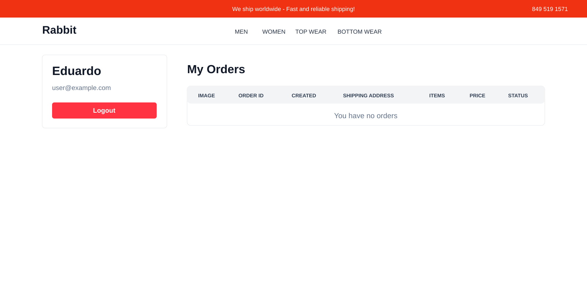
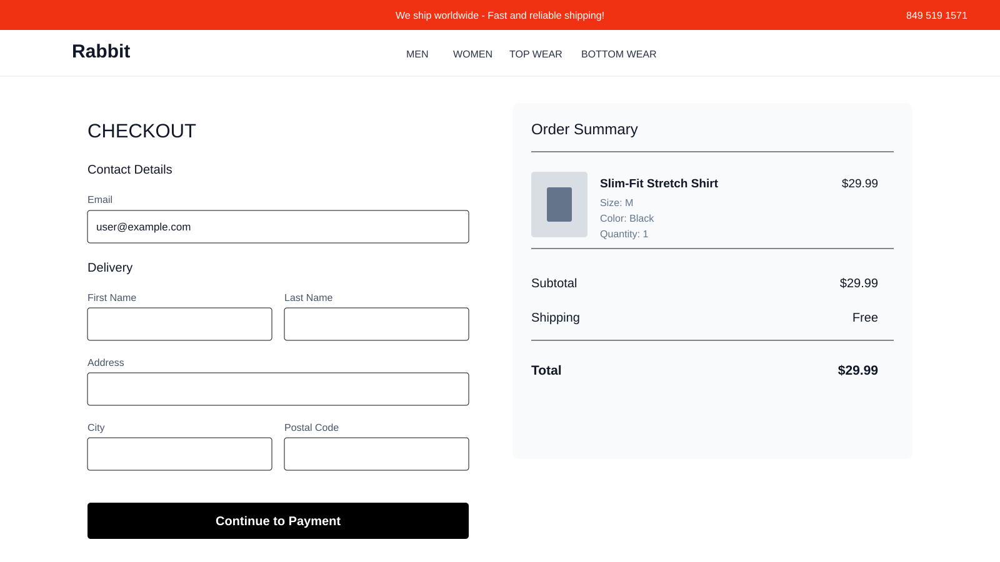
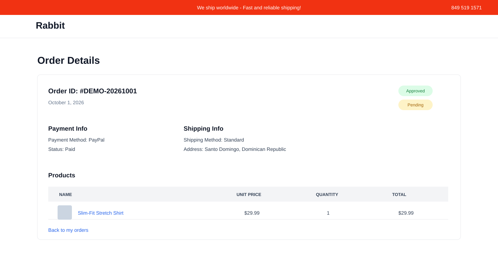

# Rabbit App

A modern full-stack fashion e-commerce application built with **Next.js, React, TypeScript, Redux Toolkit, Express, and MongoDB**. Rabbit includes product discovery, authentication, cart management, checkout, order history, payment integration, admin workflows, and responsive storefront UI.

**Live Demo:** https://rabbit-app-coral.vercel.app/

## Features

- Responsive fashion storefront
- Product catalog with filters and search
- Product details and similar products
- User registration and login
- Persistent shopping cart
- Checkout flow and order summary
- PayPal integration with demo fallback
- Customer profile and order history
- Order details and delivery/payment status
- Admin user, product, and order management
- Cloudinary product image uploads
- Redux Toolkit state management
- Mobile and desktop responsive design

## Tech Stack

### Frontend
- Next.js 15
- React 19
- TypeScript / JavaScript
- Redux Toolkit
- Tailwind CSS
- Axios
- PayPal React SDK

### Backend
- Node.js
- Express 5
- MongoDB / Mongoose
- JWT authentication
- bcrypt
- Cloudinary
- Multer

## Screenshots

### Storefront


### Profile & Orders



### Checkout



### Order Details



### Mobile


## Project Structure

```text
rabbit-app/
├── frontend/   # Next.js storefront and admin UI
└── backend/    # Express API, MongoDB models and business logic
```

## Run Locally

Clone the repository:

```bash
git clone https://github.com/eduardolluis/rabbit-app.git
cd rabbit-app
```

Install and run the frontend from `frontend/`, and install/run the API from `backend/`.

Configure the required environment variables for MongoDB, JWT, Cloudinary, and PayPal before using the complete production-backed flow.

---

## Author

**Eduardo De La Cruz**  
[Portfolio](https://portfolio-one-blue-anckqnppbh.vercel.app/) · [GitHub](https://github.com/eduardolluis) · [LinkedIn](https://www.linkedin.com/in/eduardo-de-la-cruz-b6171837a/)
